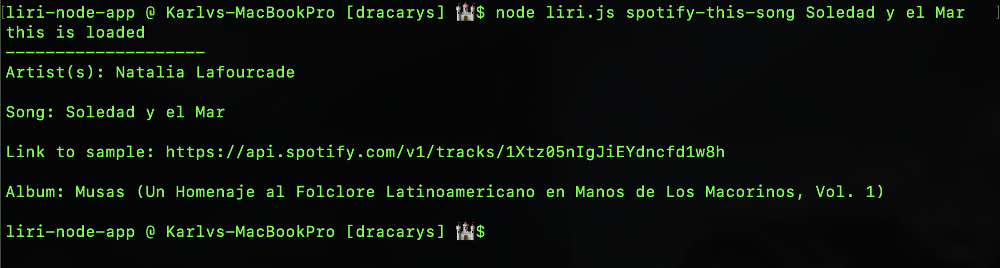

<h1># liri-node-app</h1>
<h2>Project</h2>

LIRI is a Language Interpretation and Recognition Interface. LIRI will be a command line node app that takes in parameters and gives you back data.

The goal is to help the user find information about songs, artists, music events, and movies.

<b>NOTE:</b> in order to use this app, you would need to have your own Spotify API keys,  You can get this on <a href="https://developer.spotify.com/dashboard/login">Spotify</a>

<h3>Tools used:</h3>
<ul>
  <li>Axios</li>
  <li>Node.js</li>
  <li>Spotify</li>
  <li>OMDB</li>
  <li>Bands In Town</li>
  <li>Moment</li>
  <li>DotEnv</li>
</ul>  

<h4>Step-by-Step Guide</h4>

Open your command line and go the liri-node-app folder.  You will be able to input the following commands:

<ul>
  <li>concert-this</li>
  <li>spotify-this-song</li>
  <li>movie-this</li>
  <li>do-what-it-says</li>
</ul> 

The code syntax will look like this: <code>node liri.js &#60;input one of the commands above&#62; &#60;input song/artist/movie&#62;</code>

<pre>concert-this</pre>

 
<pre>spotify-this-song</pre>

 
<pre>movie-this</pre>

 
<pre>do-what-it-says</pre>

 

Video Guide Here: 

